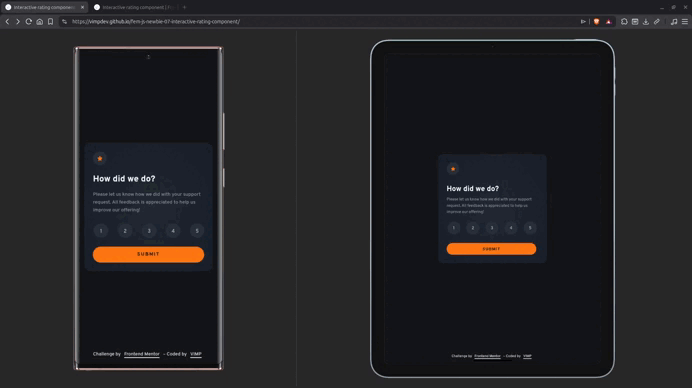

# Interactive Rating Component


An accessible and responsive interactive rating component built with semantic HTML, modern CSS, and vanilla JavaScript. The project focuses on native browser features, keyboard accessibility, and maintainable CSS architecture.

---

## Live Demo

- 🌎 [**Live Site**](https://vimpdev.github.io/fem-js-newbie-07-interactive-rating-component/)
<!-- - 📌 [**Frontend Mentor Solution**]() -->

---

## Demo



---

## Screenshots

### Mobile

| Default | States | Result |
| :-----: | :----: | :-----: |
|  |  |  |


### Tablet

| Default | States | Result |
| :-----: | :----: | :-----: |
|  |  |  |


### Desktop

| Default | States | Result |
| :-----: | :----: | :-----: |
|  |  |  |

---

## Features

- Select a rating from 1 to 5.
- Responsive layout following a mobile-first workflow.
- Accessible keyboard navigation.
- Native HTML form validation.
- Interactive hover, focus, and selected states.
- Updates the interface without reloading the page.

---

## Tech Stack

### Languages

- HTML5
- CSS3
- JavaScript (ES6+)

### CSS

- CSS Custom Properties (Design Tokens)
- CSS Nesting
- Cascade Layers
- Flexbox
- Mobile-first workflow

### Accessibility

- Semantic HTML
- Native radio group (`fieldset` + `legend`)
- Keyboard navigation
- Visible focus indicators
- Native form validation

### Tooling

- pnpm
- Servor
- Git
- GitHub Pages

---

## JavaScript Flow

The interaction is intentionally simple and relies on native browser behavior whenever possible.

```text
User submits the form
        │
        ▼
Read selected radio value
        │
        ▼
Update thank-you message
        │
        ▼
Hide rating card
        │
        ▼
Show thank-you card
```

---

## Development Highlights

- Built semantic HTML before writing styles.
- Organized styles using Cascade Layers.
- Created reusable Design Tokens with CSS Custom Properties.
- Preferred native HTML features over unnecessary JavaScript.
- Used vanilla JavaScript only for the interactive behavior.
- Structured commits as incremental development milestones.

---

## Lighthouse


Audited with Google Lighthouse via [PageSpeed Insights](https://pagespeed.web.dev/).

---

## AI Collaboration

AI was used as a technical mentor to review code, discuss architectural decisions, explore alternative implementations, and validate modern front-end practices.

The implementation, testing, and final technical decisions were made throughout the development process after understanding the underlying concepts.

---

## Author

- Frontend Mentor – [@vimpdev](https://www.frontendmentor.io/profile/vimpdev)

---

## Challenge Source

This is a solution to the [Interactive rating component challenge on Frontend Mentor](https://www.frontendmentor.io/challenges/interactive-rating-component-koxpeBUmI).